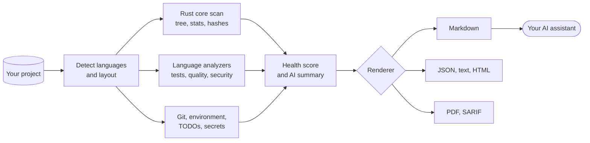

<h1 align="center"></h1>

<p align="center">
  <a href="README.md">English</a> · <b>فارسی</b>
</p>

<p align="center">
  <a href="https://github.com/msoleimani62/sarand/actions/workflows/ci.yml"></a>
  <a href="https://github.com/msoleimani62/sarand/tags"></a>
  
  
  
  <a href="LICENSE"></a>
</p>

<div dir="rtl">

<p align="center">
  <b>آن را روی هر کدبیسی اجرا کن؛ یک گزارش تحویل بگیر که هوش مصنوعی واقعاً بتواند از آن استفاده کند.</b>
</p>

<p align="center">
  <a href="#quick-start">شروع سریع</a> ·
  <a href="#install">نصب</a> ·
  <a href="#usage">استفاده</a> ·
  <a href="#report">گزارش</a> ·
  <a href="#more-tools">ابزارهای بیشتر</a> ·
  <a href="#uninstall">حذف نصب</a>
</p>

---

sarand یک پروژه را اسکن می‌کند، می‌فهمد چه نوع پروژه‌ای است، تست‌ها، linter ها و بررسی‌های امنیتی‌اش را اجرا می‌کند و **یک فایل** می‌نویسد که همه‌ی آنچه یک دستیار برنامه‌نویسی هوشمند لازم دارد در آن هست: درخت پروژه، سورس کامل، نتایج، امتیاز سلامت و یک خلاصه‌ی نوشته‌شده. آن را *پیش از* سپردن کدبیس به دستیار اجرا کن تا دستیار با واقعیت شروع کند، نه با حدس.

<a id="why"></a>

## چرا sarand

<table>
  <tr>
    <td width="50%" valign="top"><b>یک دستور، یک فایل</b><br>درخت پروژه، سورس، نتایج تست، خروجی lint، یافته‌های امنیتی و امتیاز سلامت، همه در یک فایل Markdown، JSON، متنی، HTML، PDF یا SARIF.</td>
    <td width="50%" valign="top"><b>ساخته‌شده برای هوش مصنوعی</b><br>خلاصه‌ی هوش مصنوعی و ترتیب پیشنهادی مطالعه هم دارد، تا مدل بداند از کجا شروع کند.</td>
  </tr>
  <tr>
    <td valign="top"><b>۴۰ آنالایزر برای زبان و فرمت</b><br>Python، Rust، Go، Node.js، TypeScript، C/C++‎، Java، Kotlin، Android، C#‎، Swift، PHP، Ruby، Lua، Dart، Zig، Haskell، Elixir، Erlang، Scala، shell، SQL، Nix، اسمبلی (با گویش آن) و بیشتر، به‌علاوه‌ی Dockerfile، GitHub Actions، Terraform، Protobuf، YAML، JSON، TOML، XML و Markdown. <a href="docs/COVERAGE.md">ماتریس پوشش</a> را ببین.</td>
    <td valign="top"><b>به‌طور پیش‌فرض امن</b><br>فایل‌هایی که راز (secret) دارند و فایل‌های شبیه اعتبارنامه وارد گزارش نمی‌شوند. با <code>--security</code> تاریخچه‌ی git هم اسکن می‌شود.</td>
  </tr>
  <tr>
    <td valign="top"><b>سریع و بدون گیر</b><br>اسکن سنگین در هسته‌ی Rust انجام می‌شود. اگر در دسترس نباشد، یک اسکنر معادل با پایتون خالص جایش را می‌گیرد. ابزار نصب‌نشده با یک راهنما رد می‌شود و برنامه از کار نمی‌افتد.</td>
    <td valign="top"><b>چندسکویی از پایه</b><br>طراحی شده که روی لینوکس، macOS، ویندوز و اندروید (Termux) یکسان رفتار کند. CI روی هر سه سیستم‌عامل دسکتاپ اجرا می‌شود.</td>
  </tr>
</table>

<a id="quick-start"></a>

## شروع سریع

یک‌بار نصبش کن (به Python 3.10 یا جدیدتر، زنجیره‌ابزار Rust و [pipx](https://pipx.pypa.io) نیاز دارد):

```bash
git clone https://github.com/msoleimani62/sarand.git
pipx install ./sarand
sarand --version
```

بعد داخل هر پروژه‌ای اجرایش کن:

```bash
cd ~/my-project
sarand --full
```

آخرین خط‌ها می‌گویند گزارش کجا نوشته شد (پیش‌فرض پوشه‌ی `Downloads`). نمونه‌ی خروجی:

```text
→ Detected: Rust, Python (cargo)
→ Scan engine: Rust core
→ Running tests (Python, Rust, Shell, JSON, TOML, Markdown)...
→ Running quality checks (Python, Rust, Shell, JSON, TOML, Markdown)...
→ Running security checks (Python, Rust, Shell, JSON, TOML, Markdown)...
→ Rendering Markdown report...
✓ Report completed

============================================================
Project: /home/you/my-project
Detected: Rust, Python
Engine  : Rust core
Output  : /home/you/Downloads/sarand-my-project-report.md
Files   : 163 included / 0 skipped / 1 excluded (secrets)
Health  : 76.0/100 (C)
============================================================
```

> [!TIP]
> اگر می‌خواهی ببینی چه ابزارهایی نصب است و ابزارهای نصب‌نشده را چطور اضافه کنی، اول `sarand --doctor` را اجرا کن.

<a id="how"></a>

## چطور کار می‌کند



بخش سنگین محاسباتی (پیمایش درخت، شمارش خط‌ها، هش‌کردن فایل‌ها برای یافتن تکراری‌ها) یک crate از جنس Rust است که با [PyO3](https://pyo3.rs) و [maturin](https://www.maturin.rs) در دسترس پایتون قرار می‌گیرد. هر چیزی که زیاد تغییر می‌کند، یعنی آنالایزرها، رندررها، امتیاز سلامت و CLI، پایتون خالص است. اگر افزونه‌ی Rust روی پلتفرم تو ساخته یا بارگذاری نشود، sarand به یک اسکنر پایتون خالص برمی‌گردد که همان گزارش را می‌سازد، فقط کندتر.

<a id="report"></a>

## گزارش چه چیزهایی دارد

| بخش | چه می‌گوید |
|---|---|
| Detected project | زبان‌ها، ابزارهای build و نقطه‌های ورود |
| Environment | سیستم‌عامل، CPU، حافظه و نسخه‌ی ابزارها |
| Git | شاخه، وضعیت تغییرات و تاریخچه‌ی اخیر |
| Health score | امتیاز ۰ تا ۱۰۰ با نمره و پیشنهادهای مشخص |
| AI summary | مرور نوشته‌شده و ترتیب پیشنهادی مطالعه |
| Project statistics | تعداد فایل‌ها، خط‌ها و سهم هر زبان |
| TODO / FIXME | همه‌ی نشانه‌ها با محل‌شان |
| Test results | موفقیت یا شکست هر زبان، همراه با خروجی |
| Quality checks | linter، formatter و type checker (با `--quality`) |
| Security checks | بررسی آسیب‌پذیری، راز و زنجیره‌ی تأمین (با `--security`) |
| Known issues | مشکلاتی که sarand در خروجی ابزارها شناخت |
| Project tree | درخت پروژه و، مگر با `--no-source`، همه‌ی فایل‌های واردشده |

<details>
<summary><b>sarand برای هر زبان از چه ابزارهایی استفاده می‌کند؟</b></summary>

<br>

sarand ابزارهای استاندارد هر اکوسیستم را اجرا می‌کند. هیچ‌کدام اجباری نیست: ابزار نصب‌نشده رد می‌شود و `sarand --doctor` می‌گوید چطور نصبش کنی.

| اکوسیستم | ابزارهایی که sarand به کار می‌گیرد |
|---|---|
| Python | تست: `pytest` · کیفیت: `ruff`, `mypy` · امنیت: `pip-audit`, `bandit` |
| Rust | تست: `cargo` · کیفیت: `rustfmt`, `cargo-clippy` · امنیت: `cargo-audit`, `cargo-deny` |
| Go | تست: `go` · کیفیت: `staticcheck` · امنیت: `govulncheck` |
| Node.js | تست: `npm` · کیفیت: `eslint` |
| TypeScript | کیفیت: `tsc` |
| CSS | کیفیت: `stylelint` |
| Zig | تست: `zig` |
| Swift | تست: `swift`, `xcodebuild` · کیفیت: `swift-format`, `swiftlint` |
| SQL | کیفیت: `sqlfluff` |
| C/C++ | تشخیص: `cmake` · کیفیت: `clang-tidy` · امنیت: `cppcheck` |
| Java / Kotlin / Android | تست: `mvn`، `gradle` (اگر `./gradlew` باشد از آن استفاده می‌شود) · کیفیت: checkstyle و spotbugs |
| Lua | تست: `busted` · کیفیت: `luacheck` |
| Ruby | تست: `bundle` |
| PHP | امنیت: `composer` |
| Dart / Flutter | تست: `dart` |
| Kotlin | کیفیت: `ktlint`, `detekt` |
| C# | تست: `dotnet` |
| Shell | تست: `bats` · کیفیت: `shellcheck`, `shfmt` |
| YAML | کیفیت: `yamllint` |
| Markdown | کیفیت: `markdownlint` |
| JSON | کیفیت: `jsonlint` |
| TOML | کیفیت: `taplo` |
| XML | کیفیت: `xmllint` |
| R | تست: `Rscript` |
| Perl | تست: `prove` · کیفیت: `perlcritic` |
| Julia | تست: `julia` |
| Objective-C | تست: `xcodebuild` |
| Groovy | کیفیت: `codenarc` |
| PowerShell | تست: `pwsh` |
| Nix | تست: `nix` · کیفیت: `nixpkgs-fmt` |
| Haskell | تست: `stack`، `cabal` · کیفیت: `hlint` |
| Elixir | تست، کیفیت، امنیت: `mix` (Credo و MixAudit فقط وقتی پروژه به آن‌ها وابسته باشد) |
| Erlang | تست، کیفیت: `rebar3` (‏EUnit، xref) |
| Scala | تست: `sbt` · کیفیت: scalafmt از طریق `sbt`، وقتی پروژه از آن استفاده کند |
| Dockerfile | کیفیت: `hadolint` |
| GitHub Actions | کیفیت: `actionlint` |
| Terraform | کیفیت: `terraform fmt`، `tflint` (هرگز init، plan یا apply) |
| Protobuf | کیفیت: `buf lint` |

**اسمبلی** به هیچ ابزار خارجی نیاز ندارد. sarand فایل‌های `.asm`، `.s`/`.S`، `.nasm`، `.yasm`، `.masm`، `.fasm`، `.a51`، `.a65`، `.a86` و `.z80` را در ریشه‌ی پروژه و پوشه‌های سطح اول `src/`، `asm/`، `boot/`، `kernel/` و `firmware/` می‌شناسد و *گویش* هر فایل را در بخش «Detected project» نام می‌برد: x86 (‏NASM، GNU as با سینتکس AT&T یا Intel، MASM/TASM، FASM؛ ۱۶، ۳۲ یا ۶۴ بیتی)، ARM (‏A32/T32)، AArch64، RISC-V، MIPS، PowerPC، 6502، Z80، AVR، Motorola 68000 و 8051. این یک heuristic شفاف است، نه parser: فایلی که نتواند جایش را پیدا کند به‌جای حدس به‌عنوان `Unidentified` گزارش می‌شود و هیچ چیزی اسمبل یا اجرا نمی‌شود.

بررسی‌های کل‌پروژه که با `--security` اجرا می‌شوند: `gitleaks` (رازها، از جمله در تاریخچه‌ی git) و `syft` (فهرست نرم‌افزاری وابستگی‌ها همراه با خلاصه‌ی لایسنس‌ها). خروجی PDF به `wkhtmltopdf` یا `weasyprint` نیاز دارد.

</details>

<a id="install"></a>

## نصب

### پیش‌نیازها

| چه چیزی | برای چه |
|---|---|
| Python 3.10 یا جدیدتر | اجرای sarand |
| زنجیره‌ابزار Rust ([rustup.rs](https://rustup.rs)) | ساخت هسته‌ی سریع |
| [pipx](https://pipx.pypa.io) | نصب‌کننده‌ی پیشنهادی |
| ابزارهای هر زبان | اختیاری، با `sarand --doctor` ببین |

### پیشنهادی: pipx

pipx، sarand را در محیط ایزوله‌ی خودش می‌سازد و دستور `sarand` را روی `PATH` می‌گذارد.

```bash
pipx install ~/sarand
sarand --version
```

برای به‌روزرسانی بعد از دریافت سورس جدید، به‌جای `pipx install` ساده از اسکریپت نصب استفاده کن، چون `pipx install` نسخه‌ی نصب‌شده را تازه نمی‌کند. این اسکریپت اول نصب قبلی را حذف می‌کند و بعد سورس فعلی را می‌سازد:

```bash
./install.sh
```

اگر خودِ pipx نصب نیست، با مدیر بسته‌ی سیستم نصبش کن (`sudo pacman -S python-pipx`، `brew install pipx`، `sudo apt install pipx`) یا با pip، و بعد شل را دوباره بارگذاری کن:

```bash
python3 -m pip install --user pipx
pipx ensurepath
```

> [!NOTE]
> روی سیستم‌هایی که پایتون سیستم را محافظت می‌کنند (PEP 668)، به دستور pip گزینه‌ی `--break-system-packages` را اضافه کن.

### آرچ لینوکس (AUR)

پکیج AUR طراحی شده ولی هنوز منتشر نشده، پس `yay -S sarand` امروز کار نمی‌کند. از pipx استفاده کن.

### نصب برای توسعه

```bash
pip install maturin
cd sarand
maturin develop --release
```

اگر افزونه‌ی Rust روی پلتفرم تو ساخته نمی‌شود (نادر است، ولی روی بعضی زنجیره‌ابزارهای Termux/aarch64 ممکن است)، بدون آن نصب کن و sarand روی اسکنر پایتون خالص اجرا می‌شود:

```bash
pip install -e .
```

<details>
<summary><b>نکته‌های پلتفرم: ویندوز، macOS، اندروید/Termux</b></summary>

<br>

- **ویندوز.** `install.sh` یک اسکریپت Bash است. در PowerShell به‌جایش از داخل مخزن `pipx install .` را اجرا کن.
- **macOS.** چیز خاصی نیست: pipx را با Homebrew نصب کن و مراحل بالا را برو.
- **اندروید / Termux.** همه‌چیز در ترمینال کار می‌کند. ابزار پیست (`sarand.rc`) از طریق دنباله‌ی ترمینالی OSC 52 در کلیپ‌بورد کپی می‌کند، پس به ابزار کلیپ‌بورد و نشست گرافیکی نیازی ندارد.

</details>

<a id="usage"></a>

## استفاده

| می‌خواهم… | دستور |
|---|---|
| دایرکتوری فعلی را تحلیل کنم | `sarand` |
| پروژه‌ی دیگری را تحلیل و lint کنم | `sarand --project ~/my-project --quality` |
| کامل‌ترین گزارش ممکن را بگیرم | `sarand --full` |
| بررسی‌های امنیتی را اجرا کنم | `sarand --security` |
| جست‌وجوهای کند آسیب‌پذیری را رد کنم | `sarand --security --skip-audit` |
| بدون اجرای تست، JSON بگیرم | `sarand --skip-tests --format json -o report.json` |
| خروجی PDF بگیرم | `sarand --format pdf` |
| به ابزارهای code scanning بدهم | `sarand --security --format sarif` |
| سورس را از گزارش کنار بگذارم | `sarand --no-source` |
| پوشه‌ی خروجی را یک‌بار انتخاب کنم | `sarand --set-output-dir ~/ai-reports` |
| اجرای‌های تکراری را سریع‌تر کنم | `sarand --cache` |
| محیط را بررسی کنم | `sarand --doctor` |

`--full` مخفف «همه‌چیز را بده» است: `--quality` و `--security` را روشن می‌کند و محدودیت‌های اندازه‌ی فایل، عمق درخت و تعداد ورودی‌های درخت را برمی‌دارد. اگر خودت `--max-depth` یا `--max-entries` بدهی، همان مقدار اولویت دارد.

اجرای دوباره‌ی sarand روی همان پروژه، گزارش قبلی را در همان مسیر جایگزین می‌کند و این را اعلام می‌کند، پس گزارش‌ها زیر یک نام فایل روی هم انباشته نمی‌شوند.

<details>
<summary><b>همه‌ی گزینه‌ها</b></summary>

<br>

| گزینه | معنی |
|---|---|
| `-p, --project PATH` | ریشه‌ی پروژه (پیش‌فرض: دایرکتوری فعلی) |
| `-d, --output-dir PATH` | پوشه‌ی گزارش |
| `-o, --output-name NAME` | نام فایل گزارش (پیش‌فرض: `sarand-<project>-report.<ext>`) |
| `--set-output-dir PATH` | ذخیره‌ی PATH به‌عنوان پوشه‌ی خروجی پیش‌فرض و خروج |
| `-f, --format FORMAT` | `markdown` (پیش‌فرض)، `json`، `text`، `html`، `pdf` یا `sarif` |
| `--skip-tests` | تست‌ها اجرا نشوند |
| `--quality` | بررسی lint، format و type برای هر زبان تشخیص‌داده‌شده |
| `--security` | بررسی امنیتی و آسیب‌پذیری برای هر زبان تشخیص‌داده‌شده |
| `--skip-audit` | `pip-audit` و `cargo-audit` رد شوند، چون جست‌وجوی پایگاه‌داده‌شان می‌تواند ده‌ها ثانیه طول بکشد |
| `--full` | `--quality` + `--security` + بدون محدودیت کوتاه‌سازی |
| `--max-depth N` | حداکثر عمق درخت پروژه |
| `--max-entries N` | حداکثر ورودی در هر سطح درخت |
| `--no-source` | محتوای فایل‌ها embed نشود |
| `--no-health` | امتیاز سلامت محاسبه نشود |
| `--cache` | TODO ها و رازها در فایل‌هایی که از آخرین اجرای `--cache` تغییر نکرده‌اند دوباره اسکن نشوند |
| `--clear-cache` | کش اسکن این پروژه پاک شود و خروج |
| `--doctor` | تشخیص محیط و خروج |
| `-v, --verbose` / `--debug` | لاگ بیشتر |
| `--version` | چاپ نسخه و خروج |

</details>

<a id="security"></a>

## بررسی‌های امنیتی

`--security` ابزارهای امنیتی هر زبان تشخیص‌داده‌شده را اضافه می‌کند (مثلاً `bandit` و `pip-audit` برای Python، `cargo-audit` و `cargo-deny` برای Rust، `govulncheck` برای Go) و سه بررسی کل‌پروژه:

| بررسی | چه می‌کند |
|---|---|
| اسکن راز | `gitleaks` در درخت کاری و کل تاریخچه‌ی git دنبال اعتبارنامه می‌گردد. یافته‌ها پنهان (redact) می‌شوند. |
| SBOM و لایسنس | `syft` هر وابستگی را به تفکیک اکوسیستم فهرست و لایسنس‌ها را خلاصه می‌کند. درباره‌ی copyleft فقط هشدار مشورتی می‌دهد، مگر اینکه [سیاست لایسنس](#license-policy) بنویسی. |
| بررسی lockfile | مطمئن می‌شود manifest یک lockfile دارد و آن lockfile در git نادیده گرفته نشده است. |

مستقل از این گزینه، sarand هیچ‌وقت فایلی را که رازی در آن تشخیص داده شده در گزارش نمی‌گذارد و می‌گوید چند فایل را کنار گذاشته است.

<a id="license-policy"></a>

### سیاست لایسنس

sarand به‌طور پیش‌فرض درباره‌ی لایسنس‌های copyleft فقط *هشدار مشورتی* می‌دهد، چون اهمیتش به پروژه‌ی تو بستگی دارد. اگر قوانینت را می‌دانی، آن‌ها را در یک فایل `.sarand.toml` در ریشه‌ی پروژه بنویس تا `--security` آن‌ها را روی SBOM اِعمال کند:

```toml
[licenses]
allow   = ["MIT", "Apache-2.0", "BSD-*", "ISC", "PSF-2.0"]
deny    = ["AGPL-*", "GPL-*"]
warn    = ["MPL-2.0"]
unknown = "allow"

[[licenses.exceptions]]
package = "somelib"
reason  = "GPL-3.0, used only as a build tool and never shipped"
```

| کلید | معنی |
|---|---|
| `allow` | اگر تنظیم شود، هر لایسنس باید با یکی از این‌ها (یا `warn`) مچ شود. الگوها به بزرگی و کوچکی حروف حساس نیستند و `*` را پشتیبانی می‌کنند. |
| `deny` | مچ‌شدن یعنی نقض و چک را fail می‌کند. `deny` همیشه برنده است. |
| `warn` | قابل‌قبول است ولی برای بازبینی گزارش می‌شود. |
| `unknown` | تکلیف پکیجی که لایسنس گزارش نمی‌کند: `allow` (پیش‌فرض)، `warn` یا `deny`. |
| `exceptions` | استثنای هر پکیج. نوشتن `reason` اجباری است و `version` اختیاری. |

- `A OR B` یعنی انتخاب با توست، پس پکیج با بهترین گزینه‌اش سنجیده می‌شود؛ `A AND B` یعنی همه‌ی بخش‌ها باید پاس شوند.
- املاهای رایج غیر-SPDX مثل `Apache 2.0` یا `PSFL` به شناسه‌ی SPDX نگاشت می‌شوند. هر رشته‌ی ناشناخته‌ی دیگر را باید دقیقاً همان‌طور که گزارش می‌شود در `allow` بنویسی.
- اشتباه در فایل (غلط املایی مثل `alow`، نوع اشتباه، TOML نامعتبر) خطاست و هرگز بی‌صدا نادیده گرفته نمی‌شود.
- `syft` برای crate های Rust لایسنسی نمی‌خواند، چون `Cargo.lock` لایسنس ندارد؛ پس آنجا `unknown = "allow"` را نگه دار و پوشش Rust را به `cargo deny` بسپار.

<a id="health"></a>

## امتیاز سلامت

امتیاز شفاف است و مجموعش ۱۰۰ می‌شود:

| بخش | امتیاز |
|---|---|
| تست‌ها موفق‌اند | ۲۵ |
| خطای بحرانی در کیفیت یا امنیت نیست | ۲۰ |
| ابزار تست و کیفیت وجود دارد | ۱۵ |
| تعداد TODO معقول و نظم کد | ۱۵ |
| ابزار امنیتی اجرا شده و تمیز است | ۱۵ |
| وضعیت git تمیز است | ۱۰ |

نمره‌ها: **A** از ۹۰ به بالا، **B** از ۸۰، **C** از ۷۰، **D** از ۶۰، **F** زیر ۶۰.

<a id="configuration"></a>

## پیکربندی

پوشه‌ی گزارش به این ترتیب انتخاب می‌شود:

1. `--output-dir` در خط فرمان
2. متغیر محیطی `SARAND_OUTPUT_DIR`
3. پوشه‌ای که با `--set-output-dir` ذخیره شده
4. `~/Downloads`

تنظیم ذخیره‌شده در یک فایل پیکربندی مخصوص هر کاربر است:

| سیستم | مسیر |
|---|---|
| Linux | `$XDG_CONFIG_HOME/sarand/config.json` یا `~/.config/sarand/config.json` |
| macOS | `~/Library/Application Support/sarand/config.json` |
| Windows | `%APPDATA%\sarand\config.json` |

داده‌ی `--cache` در پوشه‌ی خروجی و زیر `.sarand-cache` نگهداری می‌شود.

<a id="more-tools"></a>

## ابزارهای بیشتر

### پیست یک گزارش بزرگ در چت

بعضی چت‌ها آپلود فایل ندارند. `python3 -m sarand.rc.command` هر فایلی، معمولاً یک گزارش `sarand --full`، را به تکه‌های اندازه‌ی پیست می‌شکند. هر تکه داخل یک قاب صحت‌سنج (شناسه‌ی نشست، هش هر تکه و یک هش نهایی گزارش) قرار می‌گیرد که هوش مصنوعیِ گیرنده می‌تواند بررسی‌اش کند. تکه‌ها را یکی‌یکی جلو می‌برد و به یاد دارد کجا ایستاده‌ای، و روی ترمینال‌هایی که OSC 52 را پشتیبانی می‌کنند (از جمله Termux) هر تکه را مستقیم در کلیپ‌بورد کپی می‌کند.

```bash
sarand --full -d ~/reports
python3 -m sarand.rc.command --source ~/reports/sarand-my-project-report.md
```

برای تکه‌ی بعدی، دستور دوم را بدون هیچ گزینه‌ای دوباره اجرا کن. وضعیت در `.sarand-rc/` نگهداری می‌شود. پروتکل را از دید هوش مصنوعیِ گیرنده در [docs/RC-AI-RECEIVER.md](docs/RC-AI-RECEIVER.md) ببین.

| گزینه | اثر |
|---|---|
| `--source FILE` | فایلی که باید تکه‌تکه شود (پیش‌فرض: `README.md` یا متغیر `SARAND_RC_SOURCE`) |
| *(بدون گزینه)* | ارسال تکه‌ی بعدیِ ارسال‌نشده |
| `-i, --info` | نمایش نشست و پیشرفت |
| `-b, --back` | ارسال دوباره‌ی بلاک قبلی |
| `-br, --back-run` | ارسال دوباره‌ی آخرین مورد تاریخچه |
| `-n N` | پرش به بلاک N |
| `-c, --chunk N` | ارسال تکه‌ی N از بلاک فعلی |
| `--verify` | بررسی می‌کند تکه‌های ذخیره‌شده بایت‌به‌بایت همان فایل منبع را بازسازی کنند؛ چیزی ارسال نمی‌کند |
| `--reset`، `--clean` | پاک‌کردن وضعیت و شروع نشست تازه |

### بازرسی فضای ذخیره‌سازی و محیط دستگاه

`python3 -m sarand.device_report.command` یک ابزار جدا و **فقط‌خواندنی** است. کل دستگاه را، نه یک پروژه را، برای فضاخورهای بزرگ، فایل‌های تکراری و قدیمی، کش‌های build، ردپای package manager ها و جزئیات محیط Android/Termux اسکن می‌کند و یک گزارش Markdown می‌نویسد، به‌عنوان شاهد برای تصمیم پاک‌سازی. هیچ‌چیز را حذف، جابه‌جا، تغییر یا نصب نمی‌کند.

```bash
python3 -m sarand.device_report.command --full -o ~/device-report.md
```

<details>
<summary><b>گزینه‌های بازرسی دستگاه</b></summary>

<br>

| گزینه | اثر |
|---|---|
| `-o, --output PATH` | مسیر گزارش |
| `-r, --root DIR` | ریشه‌ی اسکن اضافه، تکرارپذیر (پیش‌فرض: `$HOME` و در صورت وجود `/sdcard`) |
| `-x, --exclude PATH` | حذف یک مسیر از همه‌ی اسکن‌ها، تکرارپذیر |
| `-q, --quick` | اسکن تکراری‌ها و فایل‌های قدیمی، که کندترین‌اند، رد شود |
| `--full` | همیشه آن اسکن‌ها اجرا شوند و سقف ردیف `--top` برداشته شود |
| `-n, --top N` | تعداد ردیف در هر جدول فضا (پیش‌فرض ۳۰) |
| `-d, --old-days N` | سن به روز برای فایل قدیمی (پیش‌فرض ۱۸۰) |
| `-m, --min-file-size MB` | حداقل اندازه برای بخش فایل‌های بزرگ (پیش‌فرض ۵۰) |
| `-u, --dup-min-size MB` | حداقل اندازه برای اسکن تکراری‌ها (پیش‌فرض ۵) |
| `-D, --max-depth N` | حداکثر عمق اسکن، ۰ یعنی نامحدود (پیش‌فرض) |
| `--min-top-space MB` | حداقل اندازه‌ی یک ردیف در جدول فضای خلاصه (پیش‌فرض ۱٫۰) |
| `--expand-aggregates` | هر پوشه‌ی کش جداگانه فهرست شود، نه یک خط برای هر الگو |
| `--summary-only` | فقط خلاصه‌ی اجرایی رندر شود؛ با `--full` هم‌زمان نمی‌شود |

</details>

### تشخیص‌های داخلی

`sarand --doctor` هسته‌ی Rust، نسخه‌ی پایتون، تک‌تک ابزارهای هر زبان و موتورهای PDF را بررسی می‌کند. هر خط می‌گوید ابزار موجود است یا نه و اگر نیست، دستور دقیق نصبش را نشان می‌دهد. نبودن یک ابزار فقط اطلاع‌رسانی است؛ تنها نسخه‌ی پشتیبانی‌نشده‌ی پایتون دستور را شکست می‌دهد. همه‌ی دستورهای بالا `--help` هم دارند.

### افزودن یک زبان با پلاگین

پروتکل `LanguageAnalyzer` (`matches`، `entry_points`، `run_tests`، `run_quality`) را در بسته‌ی خودت پیاده کن و در `pyproject.toml` ثبتش کن:

```toml
[project.entry-points."sarand.analyzers"]
zig = "sarand_zig_plugin:ZigAnalyzer"
```

sarand آن را پیدا می‌کند و کنار آنالایزرهای داخلی اجرا می‌کند.

<a id="troubleshooting"></a>

## عیب‌یابی

<details>
<summary><b><code>sarand: command not found</code></b></summary>

<br>

`pipx ensurepath` را اجرا کن و بعد ترمینال تازه باز کن. روی ویندوز هم بررسی کن پوشه‌ی bin ی pipx روی `PATH` باشد.

</details>

<details>
<summary><b>ساخت با خطای Rust شکست می‌خورد</b></summary>

<br>

یک زنجیره‌ابزار Rust از [rustup.rs](https://rustup.rs) نصب کن و دوباره امتحان کن، یا مسیر پایتون خالص را برو: `pip install -e .`.

</details>

<details>
<summary><b>یک بررسی «skipped» نشان داده می‌شود</b></summary>

<br>

ابزار پشت آن نصب نیست. `sarand --doctor` آن را همراه با دستور نصب فهرست می‌کند.

</details>

<details>
<summary><b>بررسی‌های امنیتی کند هستند</b></summary>

<br>

پایگاه‌داده‌های آسیب‌پذیری از راه شبکه پرس‌وجو می‌شوند. `--skip-audit` را اضافه کن تا `pip-audit` و `cargo-audit` رد شوند؛ بررسی‌های ایستا همچنان اجرا می‌شوند.

</details>

<details>
<summary><b>گزارش می‌گوید فایل‌هایی به‌خاطر راز کنار گذاشته شدند</b></summary>

<br>

این رفتار عمدی است. فایلی که رازی در آن تشخیص داده شود هرگز در گزارش نوشته نمی‌شود. راز را حذف یا عوض کن و دوباره اجرا کن.

</details>

<a id="uninstall"></a>

## حذف نصب

اگر با pipx نصب کرده‌ای:

```bash
pipx uninstall sarand
```

اگر نصب توسعه است:

```bash
pip uninstall sarand
```

sarand چند چیز را بیرون از بسته نگه می‌دارد. برای حذف کامل، آن‌ها را هم پاک کن:

| چه چیزی | کجا |
|---|---|
| تنظیم‌های ذخیره‌شده | فایل پیکربندی که در بخش [پیکربندی](#configuration) آمده |
| گزارش‌ها | پوشه‌ی خروجی تو، به‌طور پیش‌فرض `~/Downloads` |
| کش اسکن | `.sarand-cache` داخل پوشه‌ی خروجی (یا پیش از حذف `sarand --clear-cache` را اجرا کن) |
| وضعیت ابزار پیست | `.sarand-rc/` در دایرکتوری‌ای که اجرایش کردی |

<a id="contributing"></a>

## مشارکت

[AGENTS.md](AGENTS.md) مرجع معماری، قراردادها و نقشه‌راه است. پیش از باز کردن pull request این‌ها را اجرا کن:

```bash
ruff format .
ruff check .
mypy python
pytest -q
```

یکپارچه‌سازی پیوسته همین بررسی‌ها را روی لینوکس، macOS و ویندوز اجرا می‌کند.

## مجوز

تحت [مجوز MIT](LICENSE) منتشر شده است.

</div>
