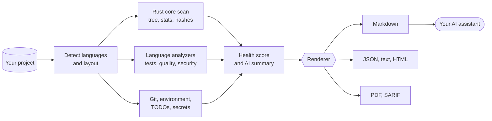

<h1 align="center"></h1>

<p align="center">
  <a href="README.md">English</a> · <b>فارسی</b>
</p>

<p align="center">
  <a href="https://github.com/msoleimani62/sarand/actions/workflows/ci.yml"></a>
  <a href="https://github.com/msoleimani62/sarand/tags"></a>
  
  
  
  <a href="LICENSE"></a>
</p>

<div dir="rtl">

<p align="center">
  <b>هر کدبیسی را به یک گزارش کامل تبدیل کنید که هوش مصنوعی واقعاً بتواند از آن استفاده کند.</b>
</p>

<p align="center">
  <a href="#quick-start">شروع سریع</a> ·
  <a href="#install">نصب</a> ·
  <a href="#usage">استفاده</a> ·
  <a href="#report">گزارش</a> ·
  <a href="#more-tools">ابزارهای دیگر</a> ·
  <a href="#uninstall">حذف نصب</a>
</p>

---

sarand پروژه‌ی شما را بررسی می‌کند، تشخیص می‌دهد از چه زبان‌ها و ابزارهایی ساخته شده، تست‌ها و lint و بررسی‌های امنیتی‌اش را اجرا می‌کند و همه‌چیز را در **یک فایل** جمع می‌کند: درخت پروژه، سورس کامل، نتیجه‌ی تست‌ها، امتیاز سلامت و یک خلاصه‌ی نوشته‌شده. اگر می‌خواهید کدبیسی را به یک دستیار برنامه‌نویسی هوشمند بسپارید، پیش از آن sarand را اجرا کنید؛ آن‌وقت دستیار کارش را با اطلاعات درست شروع می‌کند، نه با حدس.

<a id="why"></a>

## چرا sarand

<table>
  <tr>
    <td width="50%" valign="top"><b>یک دستور، یک فایل</b><br>درخت پروژه، سورس، نتیجه‌ی تست‌ها، خروجی lint، یافته‌های امنیتی و امتیاز سلامت، همه در یک فایل با قالب Markdown، JSON، متنی، HTML، PDF یا SARIF.</td>
    <td width="50%" valign="top"><b>ساخته‌شده برای هوش مصنوعی</b><br>گزارش یک خلاصه‌ی نوشته‌شده و ترتیب پیشنهادی مطالعه هم دارد تا مدل بداند از کجا شروع کند.</td>
  </tr>
  <tr>
    <td valign="top"><b>۴۰ آنالایزر برای زبان‌ها و قالب‌ها</b><br>شامل Python، Rust، Go، Node.js، TypeScript، Java، Kotlin، Swift، PHP، Ruby، Lua، Dart، Zig، Haskell، Elixir، Erlang، Scala، shell، SQL، Nix و اسمبلی با تشخیص گویش. در کنار آن‌ها C و C++ و C# و قالب‌های Dockerfile، GitHub Actions، Terraform، Protobuf، YAML، JSON، TOML، XML و Markdown را هم می‌شناسد. <a href="docs/COVERAGE.md">ماتریس پوشش</a> را ببینید.</td>
    <td valign="top"><b>امن به‌طور پیش‌فرض</b><br>فایل‌هایی که راز (secret) دارند و فایل‌های شبیه اعتبارنامه هرگز وارد گزارش نمی‌شوند. با گزینه‌ی <code>--security</code> تاریخچه‌ی git هم بررسی می‌شود.</td>
  </tr>
  <tr>
    <td valign="top"><b>سریع، و بدون گیرکردن</b><br>کار سنگین اسکن در هسته‌ی Rust انجام می‌شود و اگر آن در دسترس نباشد، یک اسکنر معادل به پایتون خالص جای آن را می‌گیرد. ابزاری که نصب نیست فقط با یک راهنما رد می‌شود و برنامه از کار نمی‌افتد.</td>
    <td valign="top"><b>چندسکویی از پایه</b><br>طراحی شده که روی لینوکس، macOS، ویندوز و اندروید (Termux) یکسان رفتار کند. CI روی هر سه سیستم‌عامل دسکتاپ اجرا می‌شود.</td>
  </tr>
</table>

<a id="quick-start"></a>

## شروع سریع

یک‌بار نصبش کنید. به Python 3.10 یا جدیدتر، زنجیره‌ابزار Rust و [pipx](https://pipx.pypa.io) نیاز دارد:

<div dir="ltr">

```bash
git clone https://github.com/msoleimani62/sarand.git
pipx install ./sarand
sarand --version
```

</div>

بعد داخل هر پروژه‌ای اجرایش کنید:

<div dir="ltr">

```bash
cd ~/my-project
sarand --full
```

</div>

خط‌های آخر خروجی می‌گویند گزارش کجا نوشته شده است (به‌طور پیش‌فرض در پوشه‌ی `Downloads`). نمونه‌ی خروجی:

<div dir="ltr">

```text
→ Detected: Rust, Python (cargo)
→ Scan engine: Rust core
→ Embedding about 12.4 MiB of source from 163 file(s)
→ Running tests (Python, Rust, Shell, JSON, TOML, Markdown)...
→ Running quality checks (Python, Rust, Shell, JSON, TOML, Markdown)...
→ Running security checks (Python, Rust, Shell, JSON, TOML, Markdown)...
→ Rendering Markdown report...
✓ Report completed

============================================================
Project: /home/you/my-project
Detected: Rust, Python
Engine  : Rust core
Output  : /home/you/Downloads/sarand-my-project-report.md
Files   : 163 included / 0 skipped / 1 excluded (secrets)
Health  : 76.0/100 (C)
============================================================
```

</div>

> [!TIP]
> اگر می‌خواهید ببینید کدام ابزارها نصب است و برای ابزارهای نصب‌نشده چه دستوری لازم است، اول `sarand --doctor` را اجرا کنید.

<a id="how"></a>

## چطور کار می‌کند

<div dir="ltr">



</div>

بخش سنگین محاسبات (پیمایش درخت، شمارش خط‌ها و هش‌کردن فایل‌ها برای پیدا کردن تکراری‌ها) یک crate به زبان Rust است که با [PyO3](https://pyo3.rs) و [maturin](https://www.maturin.rs) در اختیار پایتون قرار می‌گیرد. بقیه‌ی اجزا، یعنی آنالایزرها، رندرها، امتیاز سلامت و خط فرمان، پایتون خالص‌اند و راحت‌تر تغییر می‌کنند. اگر افزونه‌ی Rust روی سیستم شما ساخته یا بارگذاری نشود، sarand به یک اسکنر پایتونیِ خالص برمی‌گردد که همان گزارش را می‌سازد، فقط کندتر.

<a id="report"></a>

## گزارش چه چیزهایی دارد

| بخش | چه اطلاعاتی می‌دهد |
|---|---|
| Detected project | زبان‌ها، ابزارهای build و نقطه‌های ورود |
| Environment | سیستم‌عامل، پردازنده، حافظه و نسخه‌ی ابزارها |
| Git | شاخه، وضعیت تغییرات و تاریخچه‌ی اخیر |
| Health score | امتیاز ۰ تا ۱۰۰ با نمره، اطمینان و پیشنهادهای مشخص |
| AI summary | مرور نوشته‌شده و ترتیب پیشنهادی مطالعه |
| Project statistics | تعداد فایل‌ها و خط‌ها و سهم هر زبان |
| TODO / FIXME | همه‌ی نشانه‌ها همراه با محل‌شان |
| Test results | موفقیت یا شکست تست‌ها در هر زبان، به‌همراه خروجی |
| Quality checks | linter و formatter و type checker، با `--quality` |
| Security checks | بررسی آسیب‌پذیری، راز و زنجیره‌ی تأمین، با `--security` |
| Known issues | مشکلاتی که sarand در خروجی ابزارها شناخته است |
| Project tree | درخت پروژه و، مگر با `--no-source`، محتوای همه‌ی فایل‌های واردشده |

<details>
<summary><b>sarand برای هر زبان از چه ابزارهایی استفاده می‌کند؟</b></summary>

<br>

sarand از ابزارهای استاندارد هر اکوسیستم کمک می‌گیرد. هیچ‌کدام اجباری نیست: ابزاری که نصب نباشد رد می‌شود و `sarand --doctor` دستور نصبش را نشان می‌دهد.

| اکوسیستم | ابزارهایی که sarand به کار می‌گیرد |
|---|---|
| Python | تست: `pytest` · کیفیت: `ruff`, `mypy` · امنیت: `pip-audit`, `bandit` |
| Rust | تست: `cargo` · کیفیت: `rustfmt`, `cargo-clippy` · امنیت: `cargo-audit`, `cargo-deny` |
| Go | تست: `go` · کیفیت: `staticcheck` · امنیت: `govulncheck` |
| Node.js | تست: `npm` · کیفیت: `eslint` |
| TypeScript | کیفیت: `tsc` |
| CSS | کیفیت: `stylelint` |
| Zig | تست: `zig` |
| Assembly | داخلی: گویش هر فایل اسمبلی را نام می‌برد، بدون نیاز به ابزار خارجی |
| Swift | تست: `swift`, `xcodebuild` · کیفیت: `swift-format`, `swiftlint` |
| SQL | کیفیت: `sqlfluff` |
| C/C++ | تشخیص: `cmake` · کیفیت: `clang-tidy` · امنیت: `cppcheck` |
| Java / Kotlin / Android | تست: `mvn` و `gradle`؛ اگر `./gradlew` باشد از آن استفاده می‌شود · کیفیت: checkstyle و spotbugs |
| Lua | تست: `busted` · کیفیت: `luacheck` |
| Ruby | تست: `bundle` |
| PHP | امنیت: `composer` |
| Dart / Flutter | تست: `dart` |
| Kotlin | کیفیت: `ktlint`, `detekt` |
| C# | تست: `dotnet` |
| Shell | تست: `bats` · کیفیت: `shellcheck`, `shfmt` |
| YAML | کیفیت: `yamllint` |
| Markdown | کیفیت: `markdownlint` |
| JSON | کیفیت: `jsonlint` |
| TOML | کیفیت: `taplo` |
| XML | کیفیت: `xmllint` |
| R | تست: `Rscript` |
| Perl | تست: `prove` · کیفیت: `perlcritic` |
| Julia | تست: `julia` |
| Objective-C | تست: `xcodebuild` |
| Groovy | کیفیت: `codenarc` |
| PowerShell | تست: `pwsh` |
| Nix | تست: `nix` · کیفیت: `nixpkgs-fmt` |
| Haskell | تست: `stack`، `cabal` · کیفیت: `hlint` |
| Elixir | تست، کیفیت، امنیت: `mix`؛ Credo و MixAudit فقط وقتی پروژه به آن‌ها وابسته باشد |
| Erlang | تست، کیفیت: `rebar3` با EUnit و xref |
| Scala | تست: `sbt` · کیفیت: scalafmt از طریق `sbt`، وقتی پروژه از آن استفاده کند |
| Dockerfile | کیفیت: `hadolint` |
| GitHub Actions | کیفیت: `actionlint` |
| Terraform | کیفیت: `terraform fmt` و `tflint`؛ هرگز init، plan یا apply اجرا نمی‌شود |
| Protobuf | کیفیت: `buf lint` |

**اسمبلی** به ابزار خارجی نیاز ندارد. sarand فایل‌های `.asm`، `.s` و `.S`، `.nasm`، `.yasm`، `.masm`، `.fasm`، `.a51`، `.a65`، `.a86` و `.z80` را در ریشه‌ی پروژه و در پوشه‌های سطح اول `src/`، `asm/`، `boot/`، `kernel/` و `firmware/` پیدا می‌کند و *گویش* هر فایل را در بخش «Detected project» می‌نویسد:

| معماری | گویش‌ها |
|---|---|
| x86 | NASM، GNU as با سینتکس AT&T، GNU as با سینتکس Intel، MASM/TASM، FASM |
| ARM | A32/T32 |
| AArch64 | A64 |
| RISC-V، MIPS، PowerPC | یک گویش برای هر کدام |
| 6502، Z80، AVR، Motorola 68000، 8051 | یک گویش برای هر کدام |

برای x86 حالت ۱۶، ۳۲ یا ۶۴ بیتی هم تشخیص داده می‌شود. این یک روش تشخیص شفاف و مبتنی بر قاعده است، نه parser: فایلی که نتواند جایش را پیدا کند به‌جای حدس زدن با برچسب `Unidentified` گزارش می‌شود و هیچ چیزی اسمبل یا اجرا نمی‌شود.

بررسی‌های کل‌پروژه که با `--security` اجرا می‌شوند: `gitleaks` برای رازها، از جمله در تاریخچه‌ی git، و `syft` برای فهرست نرم‌افزاری وابستگی‌ها همراه با خلاصه‌ی لایسنس‌ها. خروجی PDF به `wkhtmltopdf` یا `weasyprint` نیاز دارد.

</details>

<a id="install"></a>

## نصب

### پیش‌نیازها

| چه چیزی | برای چه کاری |
|---|---|
| Python 3.10 یا جدیدتر | اجرای sarand |
| زنجیره‌ابزار Rust ([rustup.rs](https://rustup.rs)) | ساخت هسته‌ی سریع |
| [pipx](https://pipx.pypa.io) | نصب‌کننده‌ی پیشنهادی |
| ابزارهای هر زبان | اختیاری؛ با `sarand --doctor` ببینید |

### روش پیشنهادی: pipx

pipx، sarand را در یک محیط ایزوله می‌سازد و دستور `sarand` را روی `PATH` قرار می‌دهد.

<div dir="ltr">

```bash
pipx install ~/sarand
sarand --version
```

</div>

برای به‌روزرسانی بعد از دریافت سورس جدید از اسکریپت نصب استفاده کنید، نه از `pipx install` ساده، چون آن نسخه‌ی نصب‌شده را تازه نمی‌کند. اسکریپت اول نسخه‌ی فعلی سورس را می‌سازد و فقط بعد از موفقیت آن نصب قبلی را جایگزین می‌کند. اگر ساخت شکست بخورد (شبکه در دسترس نباشد یا Rust نصب نباشد)، نصب قبلی شما همان‌طور که بود برمی‌گردد، و خطاهای شبکه‌ی کند را هم خودش چند بار دوباره امتحان می‌کند:

<div dir="ltr">

```bash
./install.sh
```

</div>

اسکریپت در پایان نسخه‌ای را که نصب کرده چاپ می‌کند و اگر `sarand` دیگری در `PATH` جلوتر باشد و همان را اجرا کند، هشدار می‌دهد.

اگر خودِ pipx نصب نیست، آن را با مدیر بسته‌ی سیستم نصب کنید (`sudo pacman -S python-pipx`، `brew install pipx` یا `sudo apt install pipx`) یا با pip، و بعد شل را دوباره بارگذاری کنید:

<div dir="ltr">

```bash
python3 -m pip install --user pipx
pipx ensurepath
```

</div>

> [!NOTE]
> روی سیستم‌هایی که پایتونِ سیستم را محافظت می‌کنند (PEP 668)، گزینه‌ی `--break-system-packages` را به دستور pip اضافه کنید.

### آرچ لینوکس (AUR)

بسته‌ی AUR آماده شده ولی هنوز منتشر نشده است، پس `yay -S sarand` امروز کار نمی‌کند. از pipx استفاده کنید.

### نصب برای توسعه

<div dir="ltr">

```bash
pip install maturin
cd sarand
maturin develop --release
```

</div>

اگر افزونه‌ی Rust روی سیستم شما ساخته نمی‌شود (کم پیش می‌آید، ولی روی بعضی زنجیره‌ابزارهای Termux و aarch64 ممکن است)، بدون آن نصب کنید. sarand روی اسکنر پایتون خالص اجرا می‌شود:

<div dir="ltr">

```bash
pip install -e .
```

</div>

<details>
<summary><b>نکته‌های هر پلتفرم: ویندوز، macOS و اندروید/Termux</b></summary>

<br>

- **ویندوز.** `install.sh` یک اسکریپت Bash است. در PowerShell به‌جای آن از داخل مخزن دستور `pipx install .` را اجرا کنید.
- **macOS.** نکته‌ی خاصی ندارد: pipx را با Homebrew نصب کنید و مراحل بالا را دنبال کنید.
- **اندروید و Termux.** همه‌چیز داخل ترمینال کار می‌کند. ابزار انتقال به چت (`sarand.rc`) از دنباله‌ی ترمینالی OSC 52 برای کپی در کلیپ‌بورد استفاده می‌کند، پس به ابزار کلیپ‌بورد یا محیط گرافیکی نیازی ندارد.

</details>

<a id="usage"></a>

## استفاده

| می‌خواهم… | دستور |
|---|---|
| دایرکتوری فعلی را تحلیل کنم | `sarand` |
| پروژه‌ی دیگری را تحلیل و lint کنم | `sarand --project ~/my-project --quality` |
| کامل‌ترین گزارش ممکن را بگیرم | `sarand --full` |
| بررسی‌های امنیتی را اجرا کنم | `sarand --security` |
| جست‌وجوهای کند آسیب‌پذیری را رد کنم | `sarand --security --skip-audit` |
| بدون اجرای تست، خروجی JSON بگیرم | `sarand --skip-tests --format json -o report.json` |
| خروجی PDF بگیرم | `sarand --format pdf` |
| خروجی را به ابزارهای code scanning بدهم | `sarand --security --format sarif` |
| سورس را در گزارش نیاورم | `sarand --no-source` |
| اندازه‌ی هر فایلِ واردشده را محدود کنم | `sarand --full --max-file-size 1M` |
| پوشه‌ی خروجی را یک‌بار برای همیشه انتخاب کنم | `sarand --set-output-dir ~/ai-reports` |
| اجراهای تکراری را سریع‌تر کنم | `sarand --cache` |
| وضعیت محیط را بررسی کنم | `sarand --doctor` |

گزینه‌ی `--full` یعنی «همه‌چیز را بده»: هم `--quality` و هم `--security` را روشن می‌کند و محدودیت اندازه‌ی فایل، عمق درخت و تعداد ورودی‌های درخت را برمی‌دارد. اگر خودتان `--max-depth`، `--max-entries` یا `--max-file-size` را بدهید، همان مقدار اولویت دارد.

اگر sarand را دوباره روی همان پروژه اجرا کنید، گزارش قبلی را در همان مسیر جایگزین می‌کند و این را اعلام می‌کند؛ بنابراین گزارش‌ها زیر یک نام فایل روی هم انباشته نمی‌شوند.

### پروژه‌های بزرگ و دستگاه‌های کوچک

sarand پیش از ساختن گزارش می‌گوید چقدر سورس را داخل آن می‌گذارد (`Embedding about 12.4 MiB of source from 163 file(s)`) و اگر این مقدار برای حافظه‌ی آزاد همین دستگاه زیاد به نظر برسد هشدار می‌دهد. یک گزارش کامل `--full` از پروژه‌ی بزرگ روی گوشی یا لپ‌تاپ ۲ گیگابایتی می‌تواند کند شود یا حافظه کم بیاورد؛ این هشدار هرگز اجرا را متوقف نمی‌کند. برای گزارش سبک‌تر از `--no-source` استفاده کنید، `--max-file-size` را کمتر کنید (پیش‌فرض `2M` است و `--full` آن را برمی‌دارد) یا `--full` را نزنید.

<details>
<summary><b>همه‌ی گزینه‌ها</b></summary>

<br>

| گزینه | معنی |
|---|---|
| `-p, --project PATH` | ریشه‌ی پروژه (پیش‌فرض: دایرکتوری فعلی) |
| `-d, --output-dir PATH` | پوشه‌ی گزارش |
| `-o, --output-name NAME` | نام فایل گزارش (پیش‌فرض: `sarand-<project>-report.<ext>`) |
| `--set-output-dir PATH` | مسیر را به‌عنوان پوشه‌ی خروجی پیش‌فرض ذخیره می‌کند و خارج می‌شود |
| `-f, --format FORMAT` | پیش‌فرض `markdown` است؛ گزینه‌های دیگر `json`، `text`، `html`، `pdf` و `sarif` |
| `--skip-tests` | تست‌ها اجرا نشوند |
| `--quality` | بررسی lint، قالب‌بندی و نوع برای هر زبانِ تشخیص‌داده‌شده |
| `--security` | بررسی امنیتی و آسیب‌پذیری برای هر زبانِ تشخیص‌داده‌شده |
| `--skip-audit` | `pip-audit` و `cargo-audit` رد شوند، چون جست‌وجو در پایگاه‌داده‌ی آن‌ها می‌تواند ده‌ها ثانیه طول بکشد |
| `--full` | `--quality` و `--security` و برداشتن همه‌ی محدودیت‌های کوتاه‌سازی |
| `--max-depth N` | حداکثر عمق درخت پروژه |
| `--max-entries N` | حداکثر تعداد ورودی در هر سطح درخت |
| `--max-file-size SIZE` | بزرگ‌ترین فایل سورسی که وارد گزارش می‌شود، مثلاً `512K`، `2M` یا `1G`. پیش‌فرض `2M` است و فایل‌های بزرگ‌تر در فهرست «ردشده» می‌آیند. بر رفتار بدون‌محدودیتِ `--full` غالب است |
| `--no-source` | محتوای فایل‌ها در گزارش نیاید |
| `--no-health` | امتیاز سلامت محاسبه نشود |
| `--cache` | TODO ها و رازها در فایل‌هایی که از آخرین اجرای `--cache` تغییر نکرده‌اند دوباره جست‌وجو نشوند |
| `--clear-cache` | کش اسکنِ این پروژه پاک شود و برنامه خارج شود |
| `--doctor` | وضعیت محیط بررسی شود و برنامه خارج شود |
| `-v, --verbose` / `--debug` | لاگ بیشتر |
| `--version` | نسخه را چاپ می‌کند و خارج می‌شود؛ اگر نسخه‌ی در حال اجرا یک نصب editable کهنه باشد یادآوری می‌کند |

</details>

<a id="security"></a>

## بررسی‌های امنیتی

گزینه‌ی `--security` ابزارهای امنیتیِ هر زبانِ تشخیص‌داده‌شده را اضافه می‌کند (مثلاً `bandit` و `pip-audit` برای Python، `cargo-audit` و `cargo-deny` برای Rust، `govulncheck` برای Go) و سه بررسی کل‌پروژه:

| بررسی | چه کاری می‌کند |
|---|---|
| جست‌وجوی راز | `gitleaks` در درخت کاری و کل تاریخچه‌ی git دنبال اعتبارنامه می‌گردد. یافته‌ها پنهان (redact) می‌شوند. |
| SBOM و لایسنس | `syft` هر وابستگی را به تفکیک اکوسیستم فهرست و لایسنس‌ها را خلاصه می‌کند. درباره‌ی copyleft فقط هشدار مشورتی می‌دهد، مگر اینکه [سیاست لایسنس](#license-policy) بنویسید. |
| بررسی lockfile | مطمئن می‌شود manifest یک lockfile دارد و آن lockfile در git نادیده گرفته نشده است. |

مستقل از این گزینه، sarand هیچ‌وقت فایلی را که در آن راز پیدا شده باشد وارد گزارش نمی‌کند و اعلام می‌کند چند فایل را کنار گذاشته است.

<a id="license-policy"></a>

### سیاست لایسنس

sarand به‌طور پیش‌فرض درباره‌ی لایسنس‌های copyleft فقط *هشدار مشورتی* می‌دهد، چون اهمیت آن‌ها به پروژه‌ی شما بستگی دارد. اگر قوانین خودتان را می‌دانید، آن‌ها را در یک فایل `.sarand.toml` در ریشه‌ی پروژه بنویسید تا `--security` آن‌ها را روی SBOM اعمال کند:

<div dir="ltr">

```toml
[licenses]
allow   = ["MIT", "Apache-2.0", "BSD-*", "ISC", "PSF-2.0"]
deny    = ["AGPL-*", "GPL-*"]
warn    = ["MPL-2.0"]
unknown = "allow"

[[licenses.exceptions]]
package = "somelib"
reason  = "GPL-3.0, used only as a build tool and never shipped"
```

</div>

| کلید | معنی |
|---|---|
| `allow` | اگر تنظیم شود، هر لایسنس باید با یکی از این‌ها (یا با `warn`) بخواند. الگوها به بزرگی و کوچکی حروف حساس نیستند و `*` را پشتیبانی می‌کنند. |
| `deny` | هر لایسنسی که با این‌ها بخواند نقض به حساب می‌آید و بررسی را ناموفق می‌کند. `deny` همیشه بر بقیه غالب است. |
| `warn` | قابل‌قبول است، ولی برای بازبینی گزارش می‌شود. |
| `unknown` | تکلیف بسته‌ای که لایسنس گزارش نمی‌کند: `allow` که پیش‌فرض است، `warn` یا `deny`. |
| `exceptions` | استثنای هر بسته. نوشتن `reason` اجباری و `version` اختیاری است. |

- `A OR B` یعنی انتخاب با شماست، پس بسته با بهترین گزینه‌اش سنجیده می‌شود؛ `A AND B` یعنی همه‌ی بخش‌ها باید قابل‌قبول باشند.
- املاهای رایجِ غیر SPDX مثل `Apache 2.0` یا `PSFL` به شناسه‌ی SPDX نگاشت می‌شوند. هر رشته‌ی ناشناخته‌ی دیگر را باید دقیقاً همان‌طور که گزارش می‌شود در `allow` بنویسید.
- اشتباه در فایل (غلط املایی مثل `alow`، نوع اشتباه یا TOML نامعتبر) خطاست و هرگز بی‌صدا نادیده گرفته نمی‌شود.
- `syft` برای بسته‌های Rust لایسنسی نمی‌خواند، چون `Cargo.lock` لایسنس ندارد؛ برای Rust همان `unknown = "allow"` را بگذارید و بررسی لایسنس را به `cargo deny` بسپارید.

<a id="health"></a>

## امتیاز سلامت

امتیاز شفاف است و مجموع آن ۱۰۰ می‌شود:

| بخش | امتیاز |
|---|---|
| تست‌ها موفق‌اند | ۲۵ |
| خطای بحرانی در کیفیت یا امنیت نیست | ۲۰ |
| ابزار تست و کیفیت وجود دارد | ۱۵ |
| تعداد TODO معقول و نظم کد | ۱۵ |
| ابزار امنیتی اجرا شده و تمیز است | ۱۵ |
| وضعیت git تمیز است | ۱۰ |

نمره‌ها: **A** از ۹۰ به بالا، **B** از ۸۰، **C** از ۷۰، **D** از ۶۰ و **F** زیر ۶۰.

امتیاز فقط به اندازه‌ی بررسی‌هایی که پشتش هستند قابل‌اعتماد است، برای همین گزارش می‌گوید چند بررسی واقعاً اجرا شده است. بررسی‌ای که ابزارش نصب نیست رد می‌شود و بررسی ردشده چیزی را ثابت نمی‌کند: اگر چیزی رد شده باشد، بخش سلامت می‌نویسد چند بررسی اجرا شده و چند تا نه، یک **درصد اطمینان** می‌دهد و اسم ابزارهایی را که باید نصب کنید می‌آورد. اجرای امنیتی‌ای که همه‌ی بررسی‌هایش رد شده باشند دیگر امتیاز کامل امنیت نمی‌گیرد.

<a id="configuration"></a>

## پیکربندی

پوشه‌ی گزارش به این ترتیب انتخاب می‌شود:

1. گزینه‌ی `--output-dir` در خط فرمان
2. متغیر محیطی `SARAND_OUTPUT_DIR`
3. پوشه‌ای که با `--set-output-dir` ذخیره شده است
4. `~/Downloads`

تنظیمِ ذخیره‌شده در یک فایل پیکربندی مخصوص هر کاربر نگهداری می‌شود:

| سیستم | مسیر |
|---|---|
| Linux | `$XDG_CONFIG_HOME/sarand/config.json` یا `~/.config/sarand/config.json` |
| macOS | `~/Library/Application Support/sarand/config.json` |
| Windows | `%APPDATA%\sarand\config.json` |

داده‌ی `--cache` در پوشه‌ی خروجی و زیر `.sarand-cache` نگهداری می‌شود.

<a id="more-tools"></a>

## ابزارهای دیگر

### انتقال یک گزارش بزرگ به چت

بعضی چت‌ها امکان آپلود فایل ندارند. `python3 -m sarand.rc.command` هر فایلی، معمولاً یک گزارش `sarand --full`، را به تکه‌هایی به اندازه‌ی پیست‌کردن تقسیم می‌کند. هر تکه داخل یک قاب صحت‌سنجی (شناسه‌ی نشست، هش هر تکه و هش نهایی گزارش) قرار می‌گیرد تا هوش مصنوعیِ دریافت‌کننده بتواند آن را وارسی کند. تکه‌ها را یکی‌یکی جلو می‌برد و به یاد دارد کجا مانده‌اید؛ روی ترمینال‌هایی که OSC 52 را پشتیبانی می‌کنند (از جمله Termux) هر تکه را مستقیم در کلیپ‌بورد کپی می‌کند.

<div dir="ltr">

```bash
sarand --full -d ~/reports
python3 -m sarand.rc.command --source ~/reports/sarand-my-project-report.md
```

</div>

برای تکه‌ی بعدی، دستور دوم را بدون هیچ گزینه‌ای دوباره اجرا کنید. وضعیت در `.sarand-rc/` نگهداری می‌شود. پروتکل را از دید هوش مصنوعیِ دریافت‌کننده در [docs/RC-AI-RECEIVER.md](docs/RC-AI-RECEIVER.md) ببینید.

| گزینه | اثر |
|---|---|
| `--source FILE` | فایلی که باید تکه‌تکه شود (پیش‌فرض: `README.md` یا متغیر `SARAND_RC_SOURCE`) |
| *(بدون گزینه)* | تکه‌ی بعدیِ ارسال‌نشده را می‌فرستد |
| `-i, --info` | نشست و پیشرفت را نشان می‌دهد |
| `-b, --back` | بلاک قبلی را دوباره می‌فرستد |
| `-br, --back-run` | آخرین مورد تاریخچه را دوباره می‌فرستد |
| `-n N` | به بلاک N می‌رود |
| `-c, --chunk N` | تکه‌ی N از بلاک فعلی را می‌فرستد |
| `--verify` | بررسی می‌کند تکه‌های ذخیره‌شده بایت‌به‌بایت همان فایل منبع را بازسازی کنند؛ چیزی نمی‌فرستد |
| `--reset`، `--clean` | وضعیت را پاک می‌کند و نشست تازه‌ای شروع می‌کند |

### بازرسی فضای ذخیره‌سازی و محیط دستگاه

`python3 -m sarand.device_report.command` ابزاری جدا و **فقط‌خواندنی** است. کل دستگاه را، نه یک پروژه را، برای فضاخورهای بزرگ، فایل‌های تکراری و قدیمی، کش‌های build، ردپای مدیرهای بسته و جزئیات محیط Android و Termux بررسی می‌کند و یک گزارش Markdown می‌نویسد تا مبنای تصمیم شما برای پاک‌سازی باشد. هیچ چیزی را حذف، جابه‌جا، تغییر یا نصب نمی‌کند.

<div dir="ltr">

```bash
python3 -m sarand.device_report.command --full -o ~/device-report.md
```

</div>

<details>
<summary><b>گزینه‌های بازرسی دستگاه</b></summary>

<br>

| گزینه | اثر |
|---|---|
| `-o, --output PATH` | مسیر گزارش |
| `-r, --root DIR` | یک ریشه‌ی اسکنِ اضافه، قابل تکرار (پیش‌فرض: `$HOME` و در صورت وجود `/sdcard`) |
| `-x, --exclude PATH` | یک مسیر را از همه‌ی اسکن‌ها کنار می‌گذارد، قابل تکرار |
| `-q, --quick` | اسکن فایل‌های تکراری و قدیمی، که کندترین‌اند، رد شود |
| `--full` | همیشه آن اسکن‌ها اجرا شوند و سقف ردیف `--top` برداشته شود |
| `-n, --top N` | تعداد ردیف‌ها در هر جدول فضا (پیش‌فرض ۳۰) |
| `-d, --old-days N` | سنِ فایل قدیمی به روز (پیش‌فرض ۱۸۰) |
| `-m, --min-file-size MB` | حداقل اندازه برای بخش فایل‌های بزرگ (پیش‌فرض ۵۰) |
| `-u, --dup-min-size MB` | حداقل اندازه برای اسکن تکراری‌ها (پیش‌فرض ۵) |
| `-D, --max-depth N` | حداکثر عمق اسکن؛ صفر یعنی نامحدود (پیش‌فرض) |
| `--min-top-space MB` | حداقل اندازه‌ی یک ردیف در جدول فضای خلاصه (پیش‌فرض ۱٫۰) |
| `--expand-aggregates` | هر پوشه‌ی کش جداگانه فهرست شود، نه یک خط برای هر الگو |
| `--summary-only` | فقط خلاصه‌ی اجرایی ساخته شود؛ با `--full` هم‌زمان نمی‌شود |

</details>

### تشخیص‌های داخلی

دستور `sarand --doctor` هسته‌ی Rust، نسخه‌ی پایتون، تک‌تک ابزارهای هر زبان و موتورهای PDF را بررسی می‌کند. هر خط نشان می‌دهد ابزار موجود است یا نه و اگر نیست، دستور دقیق نصبش را می‌آورد. نبودن یک ابزار فقط اطلاع‌رسانی است؛ تنها نسخه‌ی پشتیبانی‌نشده‌ی پایتون دستور را ناموفق می‌کند.

`sarand --doctor` همچنین نشان می‌دهد کدام نسخه‌ی sarand در حال اجراست (نسخه، مسیر و اینکه نصب توسعه‌ی editable است یا نه)، و هشدار می‌دهد اگر نسخه‌ی دومی در `PATH` روی آن سایه انداخته باشد یا یک نصب editable از سورسِ خودش عقب مانده باشد. همه‌ی دستورهای بالا `--help` هم دارند.

### افزودن یک زبان با پلاگین

پروتکل `LanguageAnalyzer` را در بسته‌ی خودتان پیاده کنید، یعنی متدهای `matches`، `entry_points`، `run_tests` و `run_quality` را، و آن را در `pyproject.toml` ثبت کنید:

<div dir="ltr">

```toml
[project.entry-points."sarand.analyzers"]
zig = "sarand_zig_plugin:ZigAnalyzer"
```

</div>

sarand آن را پیدا می‌کند و کنار آنالایزرهای داخلی اجرا می‌کند.

<a id="troubleshooting"></a>

## عیب‌یابی

<details>
<summary><b>بعد از نصب، <code>sarand --version</code> نسخه‌ی قدیمی را نشان می‌دهد</b></summary>

<br>

نسخه‌ی دیگری از sarand در `PATH` جلوتر است، معمولاً یک virtualenv توسعه که هنوز فعال است، و روی نسخه‌ای که pipx تازه نصب کرده سایه انداخته. `./install.sh` در این حالت هر دو نسخه را نام می‌برد و `sarand --doctor` هم آن‌ها را فهرست می‌کند. `deactivate` را بزنید (یا نسخه‌ی قدیمی را حذف کنید) و بعد `hash -r` را اجرا کنید. اگر نصب توسعه است و نسخه‌ی ثبت‌شده‌اش از سورس عقب مانده، `maturin develop --release` آن را تازه می‌کند.

</details>

<details>
<summary><b><code>sarand: command not found</code></b></summary>

<br>

`pipx ensurepath` را اجرا کنید و بعد یک ترمینال تازه باز کنید. روی ویندوز هم بررسی کنید پوشه‌ی bin ی pipx در `PATH` باشد.

</details>

<details>
<summary><b>ساخت با خطای Rust شکست می‌خورد</b></summary>

<br>

یک زنجیره‌ابزار Rust از [rustup.rs](https://rustup.rs) نصب کنید و دوباره امتحان کنید، یا مسیر پایتون خالص را بروید: `pip install -e .`.

</details>

<details>
<summary><b>یک بررسی با برچسب «skipped» نشان داده می‌شود</b></summary>

<br>

ابزار مربوط به آن نصب نیست. `sarand --doctor` آن را همراه با دستور نصب فهرست می‌کند.

</details>

<details>
<summary><b>بررسی‌های امنیتی کند هستند</b></summary>

<br>

پایگاه‌داده‌های آسیب‌پذیری از راه شبکه پرس‌وجو می‌شوند. گزینه‌ی `--skip-audit` را اضافه کنید تا `pip-audit` و `cargo-audit` رد شوند؛ بررسی‌های ایستا همچنان اجرا می‌شوند.

</details>

<details>
<summary><b>گزارش می‌گوید بعضی فایل‌ها به‌خاطر راز کنار گذاشته شدند</b></summary>

<br>

این رفتار عمدی است. فایلی که در آن راز تشخیص داده شود هرگز در گزارش نوشته نمی‌شود. راز را حذف یا عوض کنید و دوباره اجرا کنید.

</details>

<a id="uninstall"></a>

## حذف نصب

اگر با pipx نصب کرده‌اید:

<div dir="ltr">

```bash
pipx uninstall sarand
```

</div>

اگر نصب توسعه است:

<div dir="ltr">

```bash
pip uninstall sarand
```

</div>

sarand چند چیز را بیرون از خودِ بسته نگه می‌دارد. برای حذف کامل، آن‌ها را هم پاک کنید:

| چه چیزی | کجا |
|---|---|
| تنظیم‌های ذخیره‌شده | فایل پیکربندی که در بخش [پیکربندی](#configuration) آمده است |
| گزارش‌ها | پوشه‌ی خروجی شما، به‌طور پیش‌فرض `~/Downloads` |
| کش اسکن | `.sarand-cache` داخل پوشه‌ی خروجی (یا پیش از حذف، `sarand --clear-cache` را اجرا کنید) |
| وضعیت ابزار انتقال به چت | `.sarand-rc/` در دایرکتوری‌ای که ابزار را در آن اجرا کرده‌اید |

<a id="contributing"></a>

## مشارکت

[AGENTS.md](AGENTS.md) مرجع معماری، قراردادها و نقشه‌ی راه است، و [CHANGELOG.md](CHANGELOG.md) تغییرات هر نسخه را می‌گوید. پیش از باز کردن pull request این دستورها را اجرا کنید:

<div dir="ltr">

```bash
ruff format .
ruff check .
mypy python
pytest -q
```

</div>

یکپارچه‌سازی پیوسته همین بررسی‌ها را روی لینوکس، macOS و ویندوز اجرا می‌کند.

## مجوز

این پروژه تحت [مجوز MIT](LICENSE) منتشر شده است.

</div>
