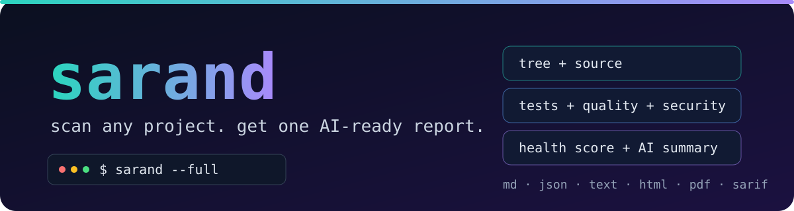
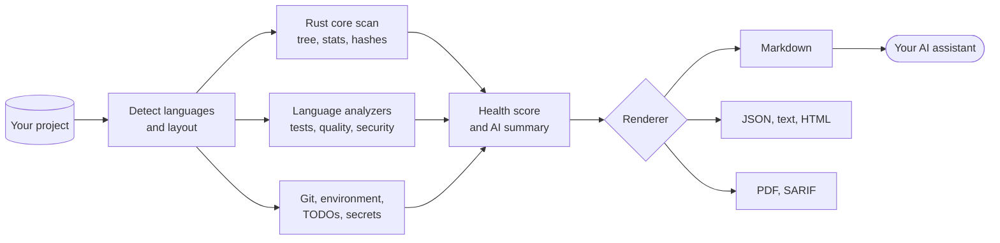

<h1 align="center"></h1>

<p align="center">
  <b>English</b> · <a href="README.fa.md">فارسی</a>
</p>

<p align="center">
  <a href="https://github.com/msoleimani62/sarand/actions/workflows/ci.yml"></a>
  <a href="https://github.com/msoleimani62/sarand/tags"></a>
  
  
  
  <a href="LICENSE"></a>
</p>

<p align="center">
  <b>Point it at any codebase. Get one report an AI assistant can actually use.</b>
</p>

<p align="center">
  <a href="#quick-start">Quick start</a> ·
  <a href="#install">Install</a> ·
  <a href="#usage">Usage</a> ·
  <a href="#whats-in-the-report">The report</a> ·
  <a href="#more-tools">More tools</a> ·
  <a href="#uninstall">Uninstall</a>
</p>

---

sarand scans a project, works out what it is, runs its tests, linters and security checks, and writes **one file** with everything an AI coding assistant needs: the project tree, the full source, the results, a health score and a written summary. Run it *before* you hand a codebase to an assistant, so the assistant starts with facts instead of guesses.

## Why sarand

<table>
  <tr>
    <td width="50%" valign="top"><b>One command, one file</b><br>Tree, source, test results, lint output, security findings and a health score, in a single Markdown, JSON, text, HTML, PDF or SARIF file.</td>
    <td width="50%" valign="top"><b>Written for AI</b><br>Includes an AI summary and a suggested reading order, so a model knows where to look first.</td>
  </tr>
  <tr>
    <td valign="top"><b>40 language and format analyzers</b><br>Python, Rust, Go, Node.js, TypeScript, C/C++, Java, Kotlin, Android, C#, Swift, PHP, Ruby, Lua, Dart, Zig, Haskell, Elixir, Erlang, Scala, shell, SQL, Nix, assembly (with its dialect) and more, plus Dockerfile, GitHub Actions, Terraform, Protobuf, YAML, JSON, TOML, XML and Markdown. See the <a href="docs/COVERAGE.md">coverage matrix</a>.</td>
    <td valign="top"><b>Safe by default</b><br>Files that contain secrets, and credential-shaped files, are left out of the report. With <code>--security</code> the git history is scanned too.</td>
  </tr>
  <tr>
    <td valign="top"><b>Fast, and never blocked</b><br>The heavy scanning runs in a Rust core. If it is not available, an equivalent pure-Python scanner takes over. A missing tool is skipped with a hint, never a crash.</td>
    <td valign="top"><b>Cross-platform by design</b><br>Meant to behave the same on Linux, macOS, Windows and Android (Termux). CI runs on all three desktop systems.</td>
  </tr>
</table>

## Quick start

Install it once (needs Python 3.10+, a Rust toolchain and [pipx](https://pipx.pypa.io)):

```bash
git clone https://github.com/msoleimani62/sarand.git
pipx install ./sarand
sarand --version
```

Then run it inside any project:

```bash
cd ~/my-project
sarand --full
```

The last lines tell you where the report went (by default the `Downloads` folder). Example output:

```text
→ Detected: Rust, Python (cargo)
→ Scan engine: Rust core
→ Running tests (Python, Rust, Shell, JSON, TOML, Markdown)...
→ Running quality checks (Python, Rust, Shell, JSON, TOML, Markdown)...
→ Running security checks (Python, Rust, Shell, JSON, TOML, Markdown)...
→ Rendering Markdown report...
✓ Report completed

============================================================
Project: /home/you/my-project
Detected: Rust, Python
Engine  : Rust core
Output  : /home/you/Downloads/sarand-my-project-report.md
Files   : 163 included / 0 skipped / 1 excluded (secrets)
Health  : 76.0/100 (C)
============================================================
```

> [!TIP]
> Run `sarand --doctor` first if you want to see which tools are installed and how to add the missing ones.

## How it works



The CPU-heavy part (walking the tree, counting lines, hashing files to find duplicates) is a Rust crate exposed to Python through [PyO3](https://pyo3.rs) and [maturin](https://www.maturin.rs). Everything that changes often, the analyzers, renderers, health score and CLI, is plain Python. If the Rust extension cannot be built or loaded on your platform, sarand falls back to a pure-Python scanner that produces the same report, only slower.

## What's in the report

| Section | What it tells you |
|---|---|
| Detected project | Languages, build tools and entry points |
| Environment | OS, CPU, memory and toolchain versions |
| Git | Branch, dirty state and recent history |
| Health score | 0–100 with a grade and concrete recommendations |
| AI summary | A written overview and a suggested reading order |
| Project statistics | Files, lines and language breakdown |
| TODO / FIXME markers | Every marker, with its location |
| Test results | Pass or fail per language, with output |
| Quality checks | Linters, formatters and type checkers (`--quality`) |
| Security checks | Vulnerability, secret and supply-chain checks (`--security`) |
| Known issues | Problems sarand recognised in the tool output |
| Project tree and files | The tree and, unless you pass `--no-source`, every included file |

<details>
<summary><b>Which tools does sarand use for each language?</b></summary>

<br>

sarand drives the standard tools of each ecosystem. Nothing here is required: a tool that is not installed is skipped and `sarand --doctor` tells you how to install it.

| Ecosystem | Tools sarand can drive |
|---|---|
| Python | tests: `pytest` · quality: `ruff`, `mypy` · security: `pip-audit`, `bandit` |
| Rust | tests: `cargo` · quality: `rustfmt`, `cargo-clippy` · security: `cargo-audit`, `cargo-deny` |
| Go | tests: `go` · quality: `staticcheck` · security: `govulncheck` |
| Node.js | tests: `npm` · quality: `eslint` |
| TypeScript | quality: `tsc` |
| CSS | quality: `stylelint` |
| Zig | tests: `zig` |
| Assembly | built in: names the dialect of every assembly file, no external tool needed |
| Swift | tests: `swift`, `xcodebuild` · quality: `swift-format`, `swiftlint` |
| SQL | quality: `sqlfluff` |
| C/C++ | detection: `cmake` · quality: `clang-tidy` · security: `cppcheck` |
| Java / Kotlin / Android | tests: `mvn`, `gradle` (uses `./gradlew` when present) · quality: checkstyle and spotbugs |
| Lua | tests: `busted` · quality: `luacheck` |
| Ruby | tests: `bundle` |
| PHP | security: `composer` |
| Dart / Flutter | tests: `dart` |
| Kotlin | quality: `ktlint`, `detekt` |
| C# | tests: `dotnet` |
| Shell | tests: `bats` · quality: `shellcheck`, `shfmt` |
| YAML | quality: `yamllint` |
| Markdown | quality: `markdownlint` |
| JSON | quality: `jsonlint` |
| TOML | quality: `taplo` |
| XML | quality: `xmllint` |
| R | tests: `Rscript` |
| Perl | tests: `prove` · quality: `perlcritic` |
| Julia | tests: `julia` |
| Objective-C | tests: `xcodebuild` |
| Groovy | quality: `codenarc` |
| PowerShell | tests: `pwsh` |
| Nix | tests: `nix` · quality: `nixpkgs-fmt` |
| Haskell | tests: `stack`, `cabal` · quality: `hlint` |
| Elixir | tests, quality, security: `mix` (Credo and MixAudit only when the project depends on them) |
| Erlang | tests, quality: `rebar3` (EUnit, xref) |
| Scala | tests: `sbt` · quality: scalafmt through `sbt`, when the project uses it |
| Dockerfile | quality: `hadolint` |
| GitHub Actions | quality: `actionlint` |
| Terraform | quality: `terraform fmt`, `tflint` (never init, plan or apply) |
| Protobuf | quality: `buf lint` |

**Assembly** needs no external tool. sarand recognises `.asm`, `.s`/`.S`, `.nasm`, `.yasm`, `.masm`, `.fasm`, `.a51`, `.a65`, `.a86` and `.z80` files in the project root and in the first-level `src/`, `asm/`, `boot/`, `kernel/` and `firmware/` folders, and names the *dialect* of each file in the "Detected project" section: x86 (NASM, GNU as with AT&T or Intel syntax, MASM/TASM, FASM; 16, 32 or 64-bit), ARM (A32/T32), AArch64, RISC-V, MIPS, PowerPC, 6502, Z80, AVR, Motorola 68000 and 8051. It is a transparent heuristic, not a parser: a file it cannot place is reported as `Unidentified` instead of a guess, and nothing is ever assembled or run.

Project-wide checks that run with `--security`: `gitleaks` (secrets, including git history) and `syft` (software bill of materials with a license summary). PDF output needs `wkhtmltopdf` or `weasyprint`.

</details>

## Install

### Requirements

| Needed | For |
|---|---|
| Python 3.10 or newer | Running sarand |
| A Rust toolchain ([rustup.rs](https://rustup.rs)) | Building the fast core |
| [pipx](https://pipx.pypa.io) | Recommended installer |
| Per-language tools | Optional, see `sarand --doctor` |

### Recommended: pipx

pipx builds sarand in its own isolated environment and puts the `sarand` command on your `PATH`.

```bash
pipx install ~/sarand
sarand --version
```

To upgrade after pulling new source, use the installer script instead of a plain `pipx install`, which does not refresh an existing copy. It builds the current source first and only then replaces the old installation; if the build fails (no network, no Rust toolchain) your previous installation is restored, and it retries slow network failures on its own:

```bash
./install.sh
```

It finishes by printing the version it installed and tells you if a different `sarand` earlier on your `PATH` would still run instead of it.

If pipx itself is missing, install it with your package manager (`sudo pacman -S python-pipx`, `brew install pipx`, `sudo apt install pipx`) or with pip, then reload your shell:

```bash
python3 -m pip install --user pipx
pipx ensurepath
```

> [!NOTE]
> On systems that protect the system Python (PEP 668) add `--break-system-packages` to the pip command.

### Arch Linux (AUR)

The AUR package is drafted but not published yet, so `yay -S sarand` does not work today. Use pipx.

### Development install

```bash
pip install maturin
cd sarand
maturin develop --release
```

If the Rust extension will not build on your platform (rare, but possible on some Termux/aarch64 toolchains), install without it and sarand runs on the pure-Python fallback:

```bash
pip install -e .
```

<details>
<summary><b>Platform notes: Windows, macOS, Android/Termux</b></summary>

<br>

- **Windows.** `install.sh` is a Bash script. In PowerShell run `pipx install .` from the repository instead.
- **macOS.** Nothing special: install pipx with Homebrew and follow the steps above.
- **Android / Termux.** Everything works in the terminal. The paste helper (`sarand.rc`) copies to the clipboard through the OSC 52 terminal sequence, so it needs no clipboard tool and no graphical session.

</details>

## Usage

| I want to… | Command |
|---|---|
| Analyse the current directory | `sarand` |
| Analyse another project and lint it | `sarand --project ~/my-project --quality` |
| Get the most complete report possible | `sarand --full` |
| Run security checks | `sarand --security` |
| Skip the slow vulnerability lookups | `sarand --security --skip-audit` |
| Write JSON without running tests | `sarand --skip-tests --format json -o report.json` |
| Export a PDF | `sarand --format pdf` |
| Feed code-scanning tools | `sarand --security --format sarif` |
| Leave the source out of the report | `sarand --no-source` |
| Choose the output folder once | `sarand --set-output-dir ~/ai-reports` |
| Cap the size of each embedded file | `sarand --full --max-file-size 1M` |
| Speed up repeat runs | `sarand --cache` |
| Check the environment | `sarand --doctor` |

`--full` is shorthand for "give me everything": it turns on `--quality` and `--security` and removes the limits on file size, tree depth and tree entries. A `--max-depth`, `--max-entries` or `--max-file-size` you pass yourself still wins.

### Large projects and small devices

Before it renders anything, sarand tells you how much source it is about to embed (`Embedding about 12.4 MiB of source from 163 file(s)`) and warns when that looks too large for the memory this machine has free. A complete `--full` report of a big project can be slow, or run out of memory, on a phone or a 2 GB laptop; the warning never blocks the run. To get a lighter report, use `--no-source`, lower `--max-file-size` (the default is 2M; `--full` removes it), or leave `--full` out.

Running sarand again on the same project replaces its previous report at that path and says so, so reports never pile up under one filename.

<details>
<summary><b>All options</b></summary>

<br>

| Option | Meaning |
|---|---|
| `-p, --project PATH` | Project root (default: current directory) |
| `-d, --output-dir PATH` | Folder for the report |
| `-o, --output-name NAME` | Report file name (default: `sarand-<project>-report.<ext>`) |
| `--set-output-dir PATH` | Save PATH as the default output folder and exit |
| `-f, --format FORMAT` | `markdown` (default), `json`, `text`, `html`, `pdf` or `sarif` |
| `--skip-tests` | Do not run tests |
| `--quality` | Run lint, format and type checks for each detected language |
| `--security` | Run security and vulnerability checks for each detected language |
| `--skip-audit` | Skip `pip-audit` and `cargo-audit`, whose database lookups can take tens of seconds |
| `--full` | `--quality` + `--security` + no truncation limits |
| `--max-depth N` | Maximum project tree depth |
| `--max-entries N` | Maximum entries per tree level |
| `--max-file-size SIZE` | Largest source file to embed, for example `512K`, `2M` or `1G` (default `2M`; larger files are listed as skipped). Overrides the no-limit behaviour of `--full` |
| `--no-source` | Do not embed file contents |
| `--no-health` | Skip the health score |
| `--cache` | Skip re-scanning TODOs and secrets in files unchanged since the last `--cache` run |
| `--clear-cache` | Delete this project's scan cache and exit |
| `--doctor` | Diagnose the environment and exit |
| `-v, --verbose` / `--debug` | More logging |
| `--version` | Print the version and exit; warns when the running copy is a stale editable install |

</details>

## Security checks

`--security` adds the security tools of every detected language (for example `bandit` and `pip-audit` for Python, `cargo-audit` and `cargo-deny` for Rust, `govulncheck` for Go) and three project-wide checks:

| Check | What it does |
|---|---|
| Secret scan | `gitleaks` looks for credentials in the working tree and the whole git history. Findings are redacted. |
| SBOM and licenses | `syft` lists every dependency per ecosystem and summarises licenses. Copyleft is advice only, unless you add a [license policy](#license-policy). |
| Lockfile check | Confirms that the manifest has a lockfile and that the lockfile is not git-ignored. |

Independently of this flag, sarand never copies a file that contains a detected secret into the report, and reports how many files it left out.

### License policy

By default sarand only *advises* about copyleft licenses, because whether one matters depends on your project. If you know your rules, write them in a `.sarand.toml` at the project root and `--security` enforces them against the SBOM:

```toml
[licenses]
allow   = ["MIT", "Apache-2.0", "BSD-*", "ISC", "PSF-2.0"]
deny    = ["AGPL-*", "GPL-*"]
warn    = ["MPL-2.0"]
unknown = "allow"

[[licenses.exceptions]]
package = "somelib"
reason  = "GPL-3.0, used only as a build tool and never shipped"
```

| Key | Meaning |
|---|---|
| `allow` | If set, every license must match one of these (or `warn`). Patterns are case-insensitive and support `*`. |
| `deny` | A match is a violation and fails the check. `deny` always wins. |
| `warn` | Acceptable, but reported for review. |
| `unknown` | What to do with a package that reports no license: `allow` (default), `warn` or `deny`. |
| `exceptions` | Per-package exceptions. A written `reason` is required, a `version` is optional. |

- `A OR B` lets you choose, so a package is judged by its best alternative; `A AND B` needs every part to pass.
- Common non-SPDX spellings such as `Apache 2.0` or `PSFL` are mapped to their SPDX ids. Any other unrecognised string must be listed in `allow` exactly as it is reported.
- A mistake in the file (a typo like `alow`, a wrong type, invalid TOML) is an error, never silently ignored.
- `syft` reads no license for Rust crates because `Cargo.lock` carries none, so keep `unknown = "allow"` there and let `cargo deny` cover Rust.

## Health score

The score is transparent and adds up to 100:

| Part | Points |
|---|---|
| Tests pass | 25 |
| No critical errors in quality or security | 20 |
| Test and quality tooling present | 15 |
| Reasonable TODO count and code hygiene | 15 |
| Security tooling run and clean | 15 |
| Clean git state | 10 |

Grades: **A** 90 and above, **B** 80, **C** 70, **D** 60, **F** below 60.

A score is only as trustworthy as the checks behind it, so the report also says how many checks actually ran. A check whose tool is not installed is skipped, and a skipped check proves nothing: when any were skipped, the Health section lists how many ran and how many did not, gives a **confidence** percentage, and names the tools to install. A security run in which every check was skipped no longer earns the full security points.

## Configuration

The report folder is chosen in this order:

1. `--output-dir` on the command line
2. The `SARAND_OUTPUT_DIR` environment variable
3. The folder saved with `--set-output-dir`
4. `~/Downloads`

The saved setting lives in a per-user config file:

| System | Location |
|---|---|
| Linux | `$XDG_CONFIG_HOME/sarand/config.json` or `~/.config/sarand/config.json` |
| macOS | `~/Library/Application Support/sarand/config.json` |
| Windows | `%APPDATA%\sarand\config.json` |

The `--cache` data is stored in the output folder under `.sarand-cache`.

## More tools

### Paste a large report into a chat

Some chats take no file upload. `python3 -m sarand.rc.command` splits any file, typically a `sarand --full` report, into paste-sized chunks. Every chunk sits inside an integrity-checked envelope (session id, per-chunk hash and a final report hash) that an AI receiver can verify. It walks you through the chunks one at a time and remembers where you stopped, and on terminals that support OSC 52 (Termux included) it copies each chunk straight to the clipboard.

```bash
sarand --full -d ~/reports
python3 -m sarand.rc.command --source ~/reports/sarand-my-project-report.md
```

Run the second command again with no options for the next chunk. State is kept in `.sarand-rc/`. See [docs/RC-AI-RECEIVER.md](docs/RC-AI-RECEIVER.md) for the protocol as the receiving AI sees it.

| Option | Effect |
|---|---|
| `--source FILE` | File to split (default: `README.md`, or the `SARAND_RC_SOURCE` variable) |
| *(none)* | Send the next unsent chunk |
| `-i, --info` | Show session and progress |
| `-b, --back` | Send the previous block again |
| `-br, --back-run` | Send the last history entry again |
| `-n N` | Jump to block N |
| `-c, --chunk N` | Send chunk N of the current block |
| `--verify` | Check that the saved chunks rebuild the source byte for byte; sends nothing |
| `--reset`, `--clean` | Delete the state and start a new session |

### Device storage and environment audit

`python3 -m sarand.device_report.command` is a separate, **read-only** tool. It scans a whole device, not one project, for space hogs, duplicate and stale files, build caches, package-manager footprints and Android/Termux environment details, and writes one Markdown report as evidence for a cleanup decision. It never deletes, moves, changes or installs anything.

```bash
python3 -m sarand.device_report.command --full -o ~/device-report.md
```

<details>
<summary><b>Device audit options</b></summary>

<br>

| Option | Effect |
|---|---|
| `-o, --output PATH` | Report path |
| `-r, --root DIR` | Extra scan root, repeatable (default: `$HOME`, plus `/sdcard` if present) |
| `-x, --exclude PATH` | Exclude a path from every scan, repeatable |
| `-q, --quick` | Skip the duplicate and stale-file scans, the two slowest |
| `--full` | Always run those scans and remove the `--top` row cap |
| `-n, --top N` | Rows per top-space table (default 30) |
| `-d, --old-days N` | Age in days for a stale file (default 180) |
| `-m, --min-file-size MB` | Minimum size for the large-files section (default 50) |
| `-u, --dup-min-size MB` | Minimum size considered for duplicate scanning (default 5) |
| `-D, --max-depth N` | Maximum scan depth, 0 for unlimited (default) |
| `--min-top-space MB` | Minimum size for a row in the summary's top-space table (default 1.0) |
| `--expand-aggregates` | List every cache directory instead of one line per pattern |
| `--summary-only` | Render only the executive summary; excludes `--full` |

</details>

### Built-in diagnostics

`sarand --doctor` checks the Rust core, your Python version, every per-language tool and the PDF engines. Each line says whether the tool is present and, if it is not, the exact command that installs it. A missing tool is informational; only an unsupported Python version fails the command. `sarand --doctor` also shows which copy of sarand is running (its version, where it lives, whether it is an editable development install) and warns when a second copy on your `PATH` shadows it or when an editable install lags behind its source tree. Every command above also answers to `--help`.

### Add a language with a plugin

Implement the `LanguageAnalyzer` protocol (`matches`, `entry_points`, `run_tests`, `run_quality`) in your own package and register it in your `pyproject.toml`:

```toml
[project.entry-points."sarand.analyzers"]
zig = "sarand_zig_plugin:ZigAnalyzer"
```

sarand finds it and runs it alongside the built-in analyzers.

## Troubleshooting

<details>
<summary><b><code>sarand --version</code> shows an old version right after installing</b></summary>

<br>

Another copy of sarand comes first on your `PATH`, typically a development virtualenv that is still active, and it shadows the one pipx just installed. `./install.sh` names both copies when this happens, and `sarand --doctor` lists them. Run `deactivate` (or remove the old copy) and then `hash -r`. If it is a development install whose recorded version lags the source, `maturin develop --release` refreshes it.

</details>

<details>
<summary><b><code>sarand: command not found</code></b></summary>

<br>

Run `pipx ensurepath`, then open a new terminal. On Windows, also check that the pipx bin folder is on `PATH`.

</details>

<details>
<summary><b>The build fails with a Rust error</b></summary>

<br>

Install a Rust toolchain from [rustup.rs](https://rustup.rs) and try again, or use the pure-Python route: `pip install -e .`.

</details>

<details>
<summary><b>A check shows as skipped</b></summary>

<br>

The tool behind it is not installed. `sarand --doctor` lists it with the install command.

</details>

<details>
<summary><b>The security checks are slow</b></summary>

<br>

Vulnerability databases are queried over the network. Add `--skip-audit` to skip `pip-audit` and `cargo-audit`; the static checks still run.

</details>

<details>
<summary><b>The report says files were excluded because of secrets</b></summary>

<br>

That is intended. Files that contain a detected secret are never written into the report. Remove or rotate the secret, then run again.

</details>

## Uninstall

Installed with pipx:

```bash
pipx uninstall sarand
```

Installed as a development install:

```bash
pip uninstall sarand
```

sarand keeps a few things outside the package. Delete them if you want a clean removal:

| What | Where |
|---|---|
| Saved settings | The config file listed under [Configuration](#configuration) |
| Reports | Your output folder, `~/Downloads` by default |
| Scan cache | `.sarand-cache` inside the output folder (or run `sarand --clear-cache` first) |
| Paste-helper state | `.sarand-rc/` in the directory where you ran it |

## Contributing

[AGENTS.md](AGENTS.md) is the source of truth for architecture, conventions and the roadmap. Before opening a pull request, run:

```bash
ruff format .
ruff check .
mypy python
pytest -q
```

Continuous integration runs the same checks on Linux, macOS and Windows.

## License

Released under the [MIT License](LICENSE).
